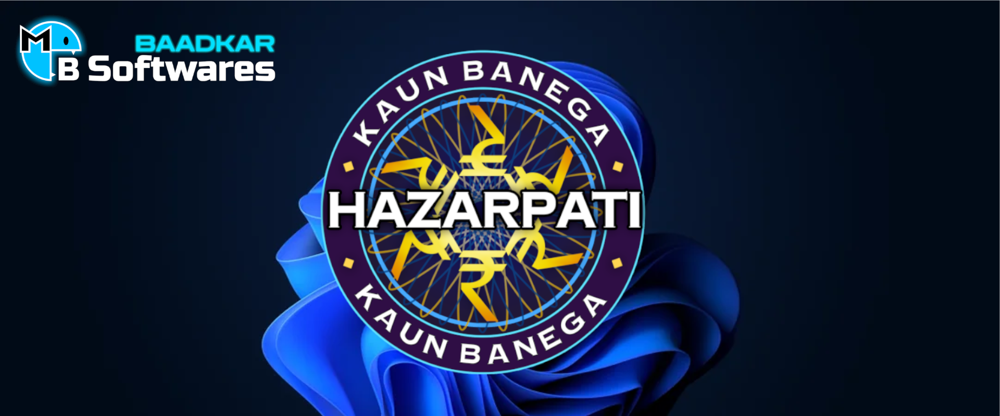
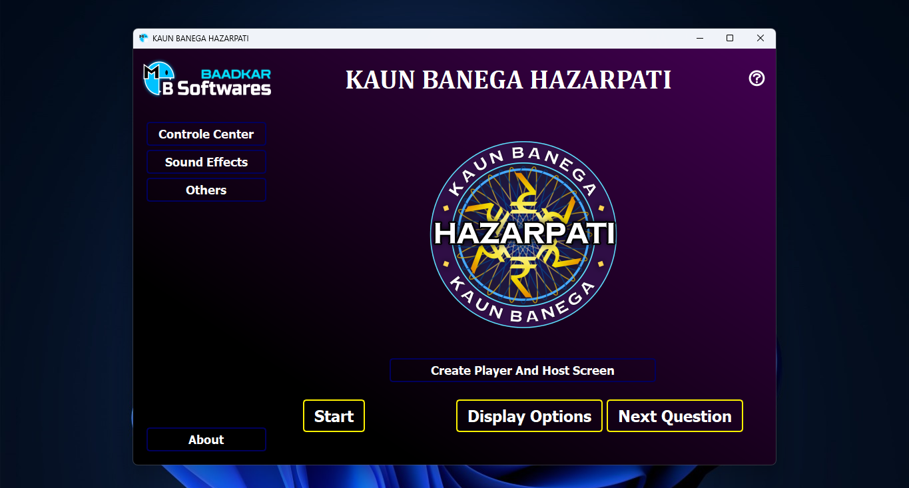
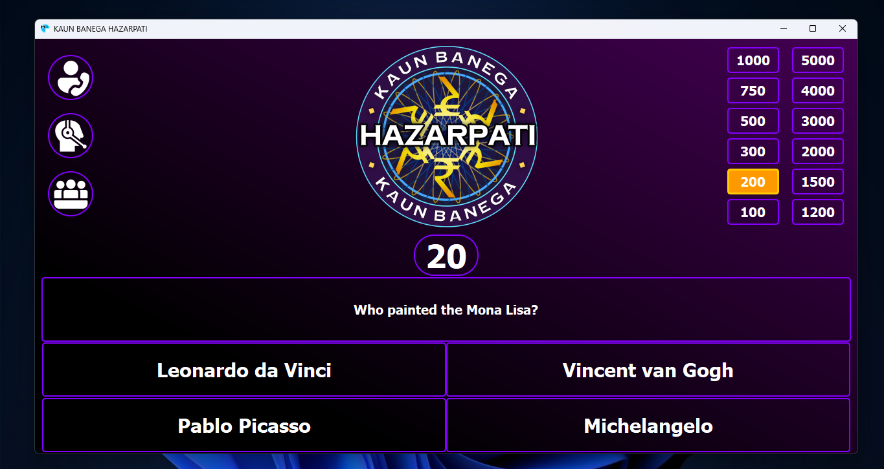

  

<h1>KBH-2.0 Software (win)</h1>
<h3>Kaun Banega Hazarpati(KBH) a desktop interactive game</h3>

The software is designed and developed by me for my college program to make students participate, win amazing rewards and have fun. The KBH Software is successfully compleated its first program and we had fun. Now KBH-2.0 is released allready.

<h3>Features and How it Works</h3>

It has two windows one is admin and another is player window. All the controles are given to admin and player window is displayed on stage screen.

Using admin Window admin an controle play KBH Theame Song, Questions, Options displaying, many more. 

<h2>Admin Window</h2>

<h2>Player Window</h2>

Player Window is designed for large screen so the screenshot displayed here is little squeezed.

For more info visit my LinkedIn <a href="https://in.linkedin.com/in/mithun-baadkar-3b669523b">@MithunBaadkar</a>

